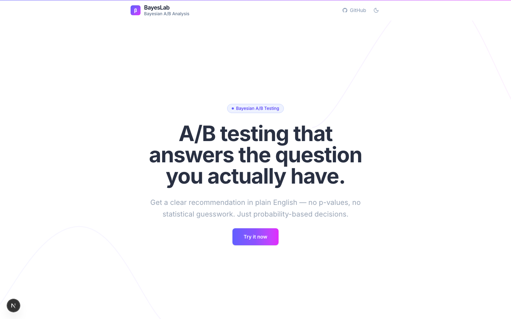
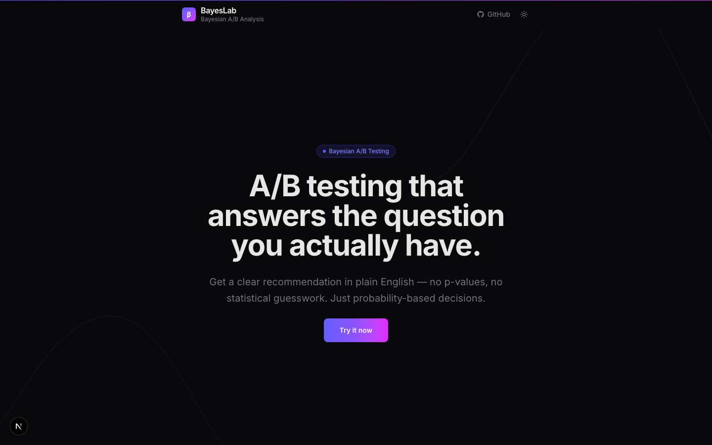
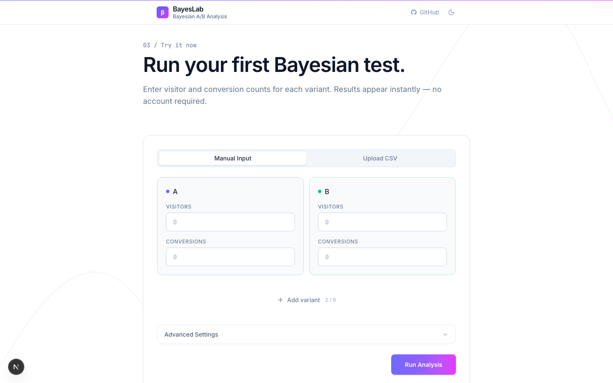
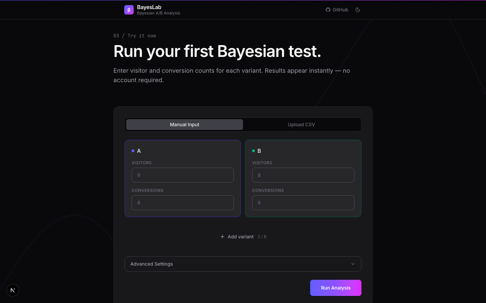
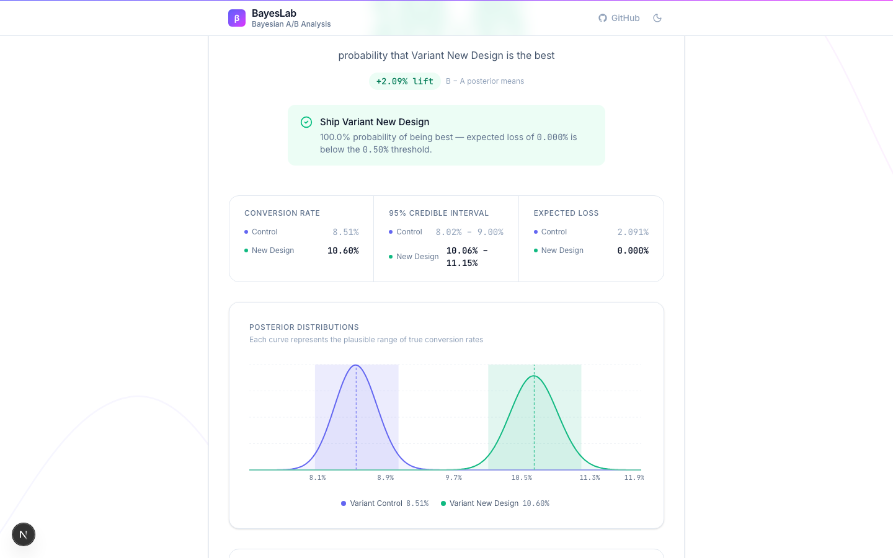
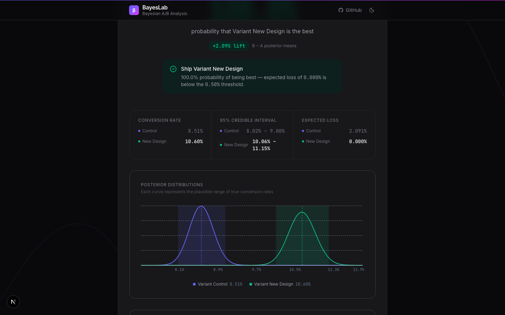

# Bayesian A/B Testing Dashboard

A web tool for analyzing A/B tests using Bayesian inference instead of p-values. Enter visitor and conversion counts for 2 to 6 variants — the engine computes posterior distributions, the probability each variant is the best, 95% credible intervals, expected loss, and a plain-English recommendation on whether you can stop the test.

[](https://github.com/Tylerr175/Bayesian-ab-testing-dashboard/actions)
[](LICENSE.md)

🚀 **[Try the live demo →](https://bayes-lab.vercel.app)**

**Hero**

| Light | Dark |
|-------|------|
|  |  |

**Analysis form**

| Light | Dark |
|-------|------|
|  |  |

**Results**

| Light | Dark |
|-------|------|
|  |  |

## Why I built this

Most A/B testing tools give you a p-value and call it a day. The problem is p-values don't actually answer the question anyone asks. "Is B better than A?" doesn't have a yes-or-no answer; it has a probability. P-values give you something different — the probability of your data assuming there's no effect — which is interesting to statisticians and useless to most people running tests.

Bayesian inference handles this directly. You get a number like "94% chance B is better than A," which is what you actually wanted to know. You also get an expected loss metric that tells you when it's safe to stop testing — without the peeking problems that haunt frequentist tests.

I wanted to build the version of this tool I'd actually use.

## How it works

Three things happen when you submit an analysis:

- **The engine fits a Beta-Binomial posterior** for each variant. Beta(1, 1) prior, observed data updates it analytically — no MCMC needed, the math is closed-form.
- **It draws 10,000 Monte Carlo samples** from each posterior. The probability each variant is the best is just the fraction of samples where it had the highest rate.
- **It returns a recommendation.** If the leading variant's expected loss drops below your threshold (default 0.5%), the tool says stop and ship. Otherwise, keep testing.

The whole computation runs in well under a second. Most of the work was making the frontend communicate the results clearly to non-statisticians.

## Stack

| Layer | Technology |
|---|---|
| Analysis engine | Python · NumPy · SciPy |
| API | FastAPI · Pydantic · Uvicorn · slowapi |
| Frontend | Next.js 16.2 · React 19.2 · TypeScript |
| Styling | Tailwind CSS v4 |
| Animation | Framer Motion 12 |
| Charts | Recharts, with Beta PDFs computed client-side via Lanczos log-Gamma |
| Icons | lucide-react |

Deployed on Vercel (frontend) and Railway (backend).

## Project structure

├── backend/
│   ├── bayesian_ab.py      # Core analysis engine
│   ├── main.py             # FastAPI app, Pydantic models, endpoints
│   ├── requirements.txt
│   ├── tests/              # pytest suite (engine + API)
│   └── .venv/              # Python virtual environment (git-ignored)
│
└── frontend/
├── app/
│   ├── page.tsx              # Scroll-narrative homepage
│   ├── layout.tsx
│   ├── globals.css
│   ├── ui/
│   │   ├── VariantForm.tsx
│   │   ├── ResultsPanel.tsx
│   │   ├── PosteriorChart.tsx
│   │   ├── HeroSection.tsx
│   │   ├── ProblemSection.tsx
│   │   ├── HowItWorksSection.tsx
│   │   ├── ToolSection.tsx
│   │   ├── StickyHeader.tsx
│   │   └── ScrollReveal.tsx
│   ├── providers/
│   │   └── ThemeProvider.tsx
│   ├── hooks/
│   │   └── useCountUp.ts
│   └── lib/
│       └── types.ts          # Shared TypeScript types (mirrors Pydantic models)
├── package.json
└── node_modules/        # git-ignored

## Running it locally

You'll need two terminals.

**Backend:**

```bash
cd backend
.venv/bin/uvicorn main:app --reload
# Runs at http://localhost:8000
```

**Frontend:**

```bash
cd frontend
npm run dev
# Runs at http://localhost:3000
```

Open http://localhost:3000 and you're set.

## Tests

```bash
pytest backend/tests/
```

The suite covers the Bayesian engine directly (probability normalization, symmetry under equal inputs, Monte Carlo convergence against a closed-form analytical reference, edge cases like zero conversions) plus the API layer via FastAPI's `TestClient`.

## API

| Method | Path | Description |
|---|---|---|
| `GET` | `/` | Root health check |
| `GET` | `/api/health` | Health check with server uptime |
| `POST` | `/api/analyze` | Run analysis (rate-limited to 30 req/min per IP) |

**POST /api/analyze — request body**

```json
{
  "variants": [
    { "name": "A", "visitors": 1000, "conversions": 100 },
    { "name": "B", "visitors": 1000, "conversions": 130 }
  ],
  "n_samples": 10000,
  "stop_threshold": 0.005
}
```

You can pass 2 to 6 objects in `variants`. `visitors` and `conversions` are each capped at 10,000,000; `n_samples` is capped at 200,000. The legacy two-field format (`a_visitors`, `a_conversions`, `b_visitors`, `b_conversions`) still works for backwards compatibility.

**Response**

```json
{
  "variants": [
    {
      "name": "A",
      "posterior_params": { "alpha": 101.0, "beta": 901.0 },
      "posterior_mean": 0.1008,
      "credible_interval": { "lower": 0.0827, "upper": 0.1204 },
      "prob_best": 0.016,
      "expected_loss": 0.0299
    },
    {
      "name": "B",
      "posterior_params": { "alpha": 131.0, "beta": 871.0 },
      "posterior_mean": 0.1307,
      "credible_interval": { "lower": 0.1101, "upper": 0.1529 },
      "prob_best": 0.984,
      "expected_loss": 0.0001
    }
  ],
  "recommendation": {
    "action": "STOP",
    "winner": "B",
    "winner_loss": 0.0001,
    "threshold": 0.005
  }
}
```

## Methodology


For a detailed walkthrough of the model, output computation, and limitations, see the [methodology page](https://bayes-lab.vercel.app/methodology) on the live site.

Reference: [Evan Miller, *Formulas for Bayesian A/B Testing*](https://www.evanmiller.org/bayesian-ab-testing.html).

## About

Built by [Tyler Greenwell](https://www.linkedin.com/in/tylergreenwell) — a portfolio project covering statistical engineering, full-stack development, and production deployment.

## License

MIT. See [LICENSE.md](LICENSE.md).
